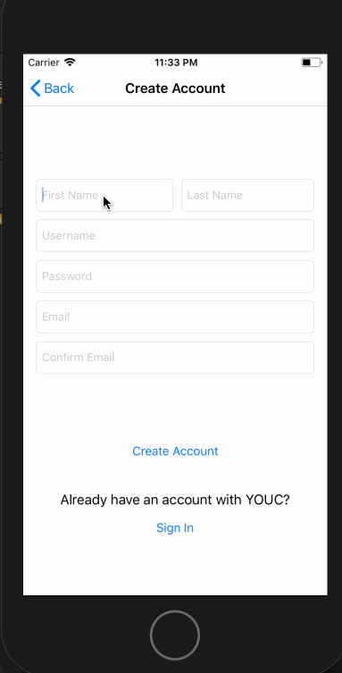
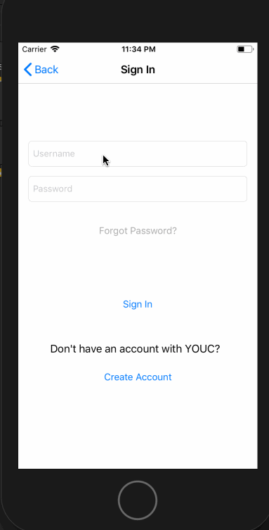
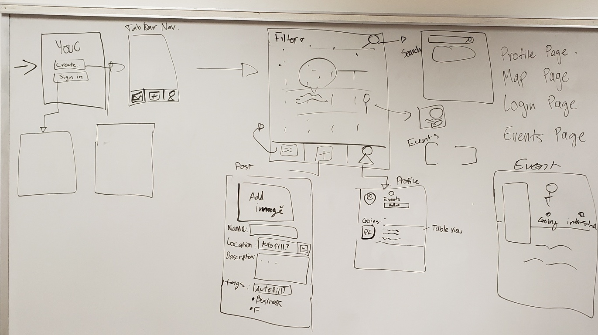

# YOUC

## Developers
* **Derek Chang**
   -Map view
   -Involves creating a map that shows all the events
   -Ability to filter events on the events coming soon
   
* **Tejal Patel**
   - Login View
   - 
   - 
* **Richard Absin**
   - Making the Event Page
   - Here, users can see more information about an event
   - They also have the option of marking "GOING" or "INTERESTED" on the event
   
* **Hermain Hanif**
   - Making the Profile Page:
   
* **Beverly Abadines Quon**
   - Creating Events (Post Page):
   -  

### App Description
YOUC Event Page connects UCI students to events happening all over campus!

### App Idea Evaluation
- Mobile: This app can be used anywhere and lets students organize all the cool events happening near them. 
It integrates features such as maps, camera, location, and event summaries using tableviews.
- Story: It helps students be more aware of events happening. Clubs and other organizations would love have to this.
- Market: For now it is targeted to UCI students, but it can be expanded to other universities, businesses, and admins.
   Yes, it provides the huge value of connecting everyone. 
- Habit: Whenever students are free and want to attend events based on their interest, they can use our app! Users can create events too! 
- Scope: It is challenging and the work is split up into at least 5 different goals, yet it all has to integrate  together. 
Yes, even without the optional goals, YOUC Event Page is still meritable app. Our team sees the vision for this app. 

## 1. User Stories (Required and Optional)

**Required Must-have Stories**

1) Login and Logout
   + Persistent login
2) Users can view events nearby 
   + Displays events via pins on Map
   + Can Search events using search bar and tableview
3) Users can see a detailed view of Events
   + Displays cover image, name of event, time, place and summary
4) Users can access their profile
   + Users can modify their personal information using settings or seek help via contacts
   + Users see their basic information (name, profile image, # of events going to)
   +  Displays the list of events the user wants to go to
* Relies on user's (clubs/vendors/anyone) to post events
* User can say (going, interested)
* Sort based on location
* Mapkit!!

* Suggestions(based on user preferences - major, interests, location)
* Target Market: Clubs/events that aren't specifically heard on facebook
* Displays Events Nearby
* Displays Events that the user is going to
* User can Create Events
* Includes profile and login/logout functionalities

**Optional Nice-to-have Stories*
 * Other universities/colleges can use
 * Notifications
 * if user wants to see and edit the event they just posted
 * Share events with other users 
 * Share events with other organizations/collabs 
 * MeetUp app functionalities(meet up with group events)
 * Direct Messaging??
 * After signing up for an event, you get an email that allows you to save the event to your calendar
 add google sign in
 * Each post(sorted by school) will have tags that allow for organization
 * Favorite events
 * Separate user profiles and organization profiles
 * Extended Login features
 * Users can share videos of their club
 * Swipe gestures! (acts like a back button)
 * For mall events that are cool, but not known by the majority
 * Sort based on event popularity/recent
 
 
 

## 2. Screen Archetypes

 * Launch Screen = Logo
 * Login 
     * Request Access user generated information on parse
     * Separate btwn User vs. Organization Admin vs. Guest
* Second Screen = Map with Interested Events 
 * User Profile page
     * (Separate kinds of users - ORGANIZATION or USER)
     * edit profile page(button)
     * add profile picture(static - top right, like instagram layout)
     * display past posts(scroll view)

## 3. Navigation

**Tab Navigation** (Tab to Screen)
* Tabs:
  * Map
    * includes searching for events
    * pins events, click to event details 
      * modally segues title, and summary of event
         * "see more" to modally segue to organization event page
     
   * Profile Tab
      * has profile image, name and events user is going to
      * Includes button for "Settings"
   * Post Tab
   * Ask for event information
      * Uses AFNetworking and foursquare api for locations
      * Includes table view for searching locations
      * Resets values after submit

**Flow Navigation** (Screen to Screen)
* Screens:
  * Launch Screen
  * Login Screen
    * Sign in or Create (respectively) 
    * If already signed in, then there is persistent login
    * Leads to 3 tabs mentioned above  
  * Map Tab
    * map with events as pins
      * pins lead to Event Page (can add events)
    * search bar leads to tableview of events near Area
  * Profile Tab
    * Displays Events user is going to 
    * Includes Settings
  * Settings 
    * Updates user info
    * Includes Logout
    * Leads to "Contact Us" 
  * Post Tab
    * Create Event
      * Leads to Tableview of Location
      * Image Picker for updating cover album
      * Stays on page after submit
       
### Wireframes

### App Pitch Presentation
https://docs.google.com/presentation/d/1yzsn-Yyz0DSc1R-ORoaFYQVD9UbwtR0EuMSXdHHQ-SA/edit?usp=sharing

